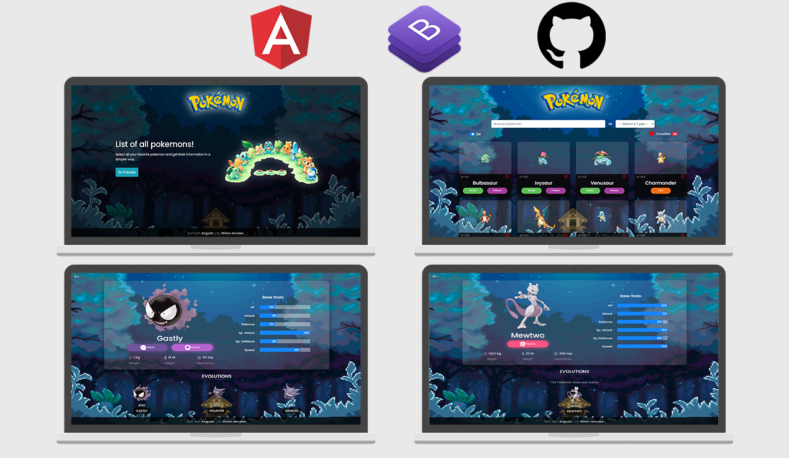

<div align="center">
  
</div>

# Pokedex

This project was generated with [Angular CLI](https://github.com/angular/angular-cli) version 12.2.18.

### DEMO: [App Pokedex](https://ng-pokedev.netlify.app/)

# Functionalities

- [x] Responsive Design
- [x] List all Pokémon of all generations
- [x] Show information about pokemons and their evolutions
- [x] filter the data of the pokemon according to its evolutions
- [ ] Search for a pokemon
- [ ] Filter pokemon according to its type
- [ ] Change the mode of the image using a SlideToggle
- [ ] Add pokemon to favorites

## Responsive




### The following API was used:

> PokeAPI --> https://pokeapi.co/

## Implemented Dependencies: 
* ngx-toastr
```
npm i ngx-toastr
```

## Note: 
### Install dependencies for running this project
```
npm install
```